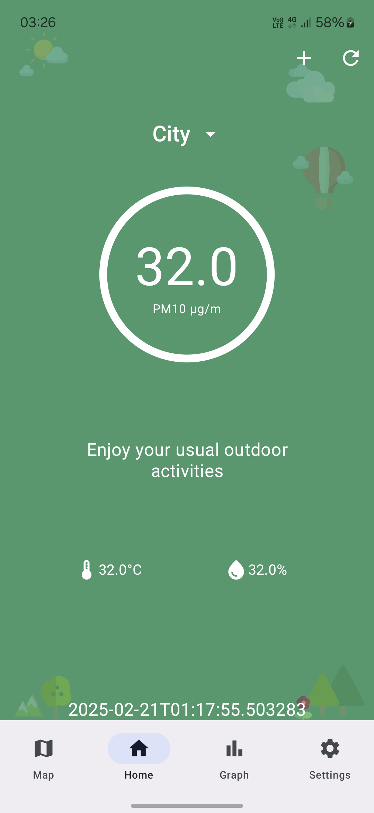
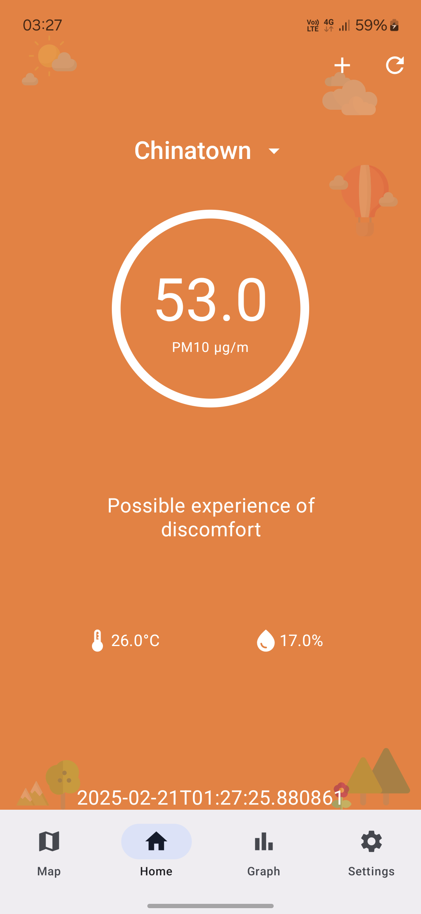
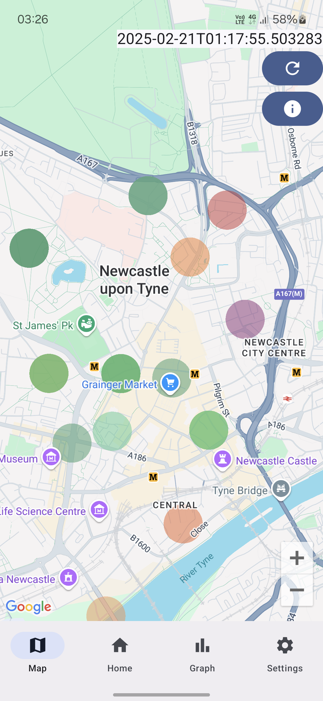
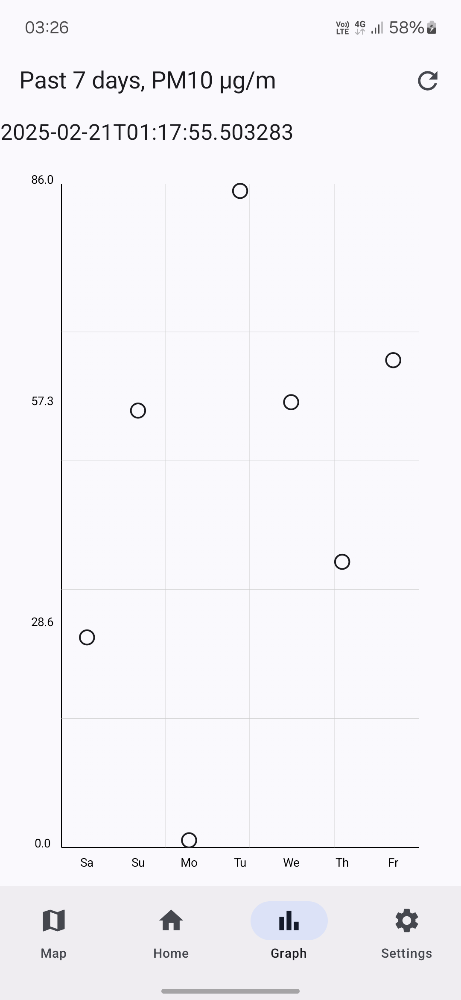

# NewAir

This repo is for the app itself only. For component implementations below ViewModel level, see repo [air](https://github.com/vladislav-iliev/air)

## Goal
NewAir is an Android app that displays air data from Newcastle upon
Tyne, England. Using real-time sensors from Newcastle University's
Urban Observatory (see 2023 update below), it displays the air Pollution
(PM10 particles), Temperature, and Humidity from across the city.

For user convenience, the User Interface changes colour and provides a health
recommendation according to the pollution, signifying the severity
of pollution levels. The colours and messages are selected according to the 
Daily Air Quality Index from the Department for Environment, Food & 
Rural Affairs, United Kingdom.

Data is displayed in text form for:
* Overall city, the average of all available sensors.
* Custom locations of interest, which users could add via interacting with 
a map. Data is displayed using the nearest sensor to the added location.

Data is also displayed in graphic form using a map. Sensor 
locations and their readings are displayed via coloured markers.

Additionally, history data is available for the averages of the last 7 days.
Displayed on a graph.

## Videos
### Data persistence & preloaded City
https://github.com/vladislav-iliev/NewAir/blob/main/media/videos/preload_persistence.mp4
### User locations
https://github.com/vladislav-iliev/NewAir/blob/main/media/videos/add_delete_user_locations.mp4
### Map & graph
https://github.com/vladislav-iliev/NewAir/blob/main/media/videos/maps_graph.mp4

## 2025 Update
* Migrated to Jetpack Compose
* Data flow remade, now using Kotlin Flows
* Offline-first: Data is persistently stored in Android Room database
* User locations now selected via paginated list
* Data packages extracted to external repository

## 2023 Update
* Sensor data now **local and randomized**, making the app a Proof of Work.
Downloading data from Newcastle Urban Observatory too slow to use worldwide
* Migrated to Kotlin
* Data flow remade, now using ViewModel and LiveData
* Navigation remade, now using Navigation Component. Bottom navigation bar
now only visible in Home, deemed unnecessary elsewhere
* Downloads now via Kotlin Coroutines
* UI elements revisited, assets migrated to Vector graphics
* GPS and Distance to nearest sensor deemed unnecessary and removed

## Authors
### Initial
First developed in 2018 in Newcastle University

B. Wilsher, I. Gylaris, I. Watt, L.P. Stannard,
Vladislav Iliev, V.M.T. Godsell

### Ongoing
Maintained since by Vladislav Iliev